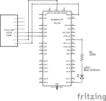

# Ducky

This is a demo of how to bring in real time sensor data to a simulated environment

# Hardware

Schematic Design

Here's a breadboard as well

# Setup guide

Create a config.jsonc file on the microcontroller with the SSID and PASSWORD set as well as the IP address of the device.

Also don't forget to open the port on your firewall
which you want to use for the websocket server, (I recommend only doing this temporarily).

# Made possible by

https://tinytreats.itch.io/bubbly-bathroom

https://godot.rapier.rs/

(needed porting to remove ESP specific details)  
https://github.com/Lezgend/MPU6050-MicroPython
